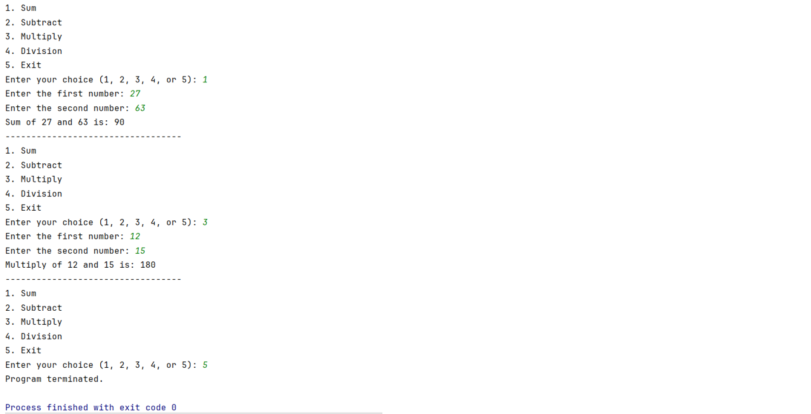

## Coding challenges

### Create a simple calculator program that performs addition, subtraction, multiplication, and division.

The program should:
- Prompt the user to enter two numbers.
- Prompt the user to choose an operation: addition, subtraction, multiplication, or division.
- Perform the chosen operation on the input numbers and display the result.

#### To complete this assignment, you will need to use:
- Variables to store user input and the result
- Scanner class to read input from the user
- if statements or a switch statement to determine the chosen operation
- Basic arithmetic operators (+, -, *, /)
- System.out.println() to display output

### Output

### Create a number guessing game program that generates a random number between 1 and 100 and prompts the user to guess the number.

The program should:
- Generate a random number between 1 and 100.
- Prompt the user to guess the number.
- Provide feedback on whether the guess is too high, too low, or correct.
- Repeat steps 2 and 3 until the user guesses the correct number.
- Display the number of attempts it took the user to guess the correct number.

#### To complete this assignment, you will need to use:
- Variables to store the random number, user input, and number of attempts
- Random class to generate a random number
- Scanner class to read input from the user
- while or do-while loop to repeat the guessing process
- if statements or a switch statement to provide feedback on the user's guess
- System.out.println() to display output

### Output

